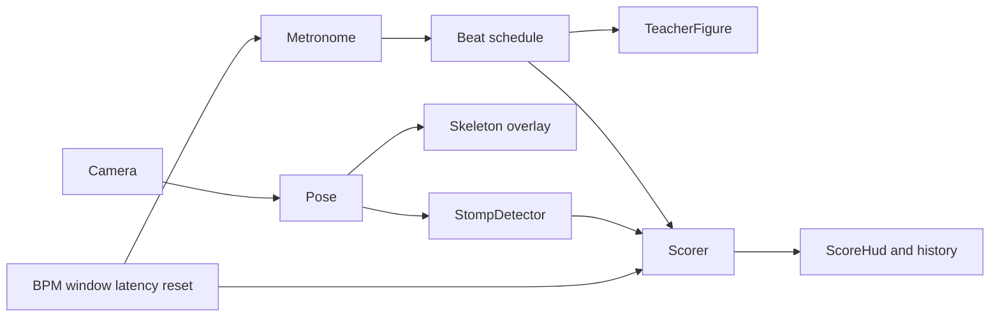

# Rhythm Sync — архитектура

Документ опирается на [spec.md](./spec.md).

## Стек

- Vite + React + TypeScript
- Web Audio API — метроном
- MediaPipe Pose Landmarker (`@mediapipe/tasks-vision`) — поза
- Vitest — unit-тесты ядра (`src/lib/*`)

Бэкенда нет.

## Модули

| Модуль | Файл | Ответственность |
|--------|------|-----------------|
| Metronome | `src/lib/metronome.ts` | Клики и расписание битов в `AudioContext` time → `performance.now` |
| Pose | `src/lib/pose.ts` | Инициализация MediaPipe, `detectForVideo` |
| StompDetector | `src/lib/stompDetector.ts` | Landmarks → события топа |
| Scorer | `src/lib/scorer.ts` | Сопоставление топов с битами, hit/miss, offset |
| Stick figure | `src/lib/stickFigure.ts` | Поза учителя + отрисовка скелета |
| App / UI | `src/App.tsx`, `src/components/*` | Состояние занятия, контролы, HUD — **без** расчёта ритма |

## Поток данных



1. `Metronome` планирует биты lookahead-ом и вызывает `onBeat(beatTimeMs, index)`.
2. `App` передаёт бит в `Scorer.addBeat` и обновляет анимацию учителя.
3. Кадр камеры → `Pose` → landmarks → overlay; при `running` → `StompDetector.update`.
4. Событие топа → `Scorer.registerStomp` (с latency compensation) → hit или игнор.
5. Периодический `Scorer.tick` закрывает просроченные биты как miss.
6. UI читает только `ScoreSnapshot` и рисует feedback/ленту.

## Ключевые решения

### Окно попадания

По умолчанию **±220 ms**. Настраивается в UI (релиз v2). Биты вне окна без топа становятся miss после `window + latency`.

### Компенсация камеры

По умолчанию **120 ms**: время топа для матчинга = `detectedAt - latencyMs`. Настраивается в UI. Цель — выровнять поздно приходящий кадр с кликом метронома.

### Режим «Только ноги»

- Display-кроп нижней части кадра (`y ∈ [0.35, 1]`).
- Overlay рисует только leg landmarks.
- MediaPipe по-прежнему получает полный кадр (координаты landmarks не ломаются).

### Границы ответственности

- UI **не** считает hit/miss и **не** детектит топ.
- Unit-тесты покрывают `lib/*` синтетическими landmarks/beats; камера и MediaPipe в unit-тестах не используются.

## Структура `src/`

```text
src/
  App.tsx
  components/
    TeacherFigure.tsx
    CameraStage.tsx
    MetronomeControls.tsx
    ScoreHud.tsx
  lib/
    metronome.ts
    pose.ts
    stompDetector.ts
    scorer.ts
    stickFigure.ts
```

## Расширение

Новое упражнение = новый детектор события + поза учителя; `Scorer` и `Metronome` переиспользуются. Не добавлять музыку/бэкенд без явного изменения spec.
